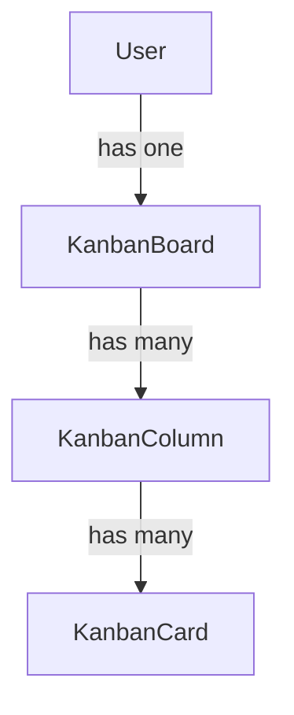

# Kanban Database Schema

## Entity-Relationship Diagram



## Tables

### Users

**Purpose**: User accounts (currently hardcoded for MVP)

| Column | Type | Constraints | Description |
|--------|------|-------------|-------------|
| id | INTEGER | PRIMARY KEY, AUTOINCREMENT | User ID |
| username | VARCHAR(50) | UNIQUE, NOT NULL | Username |
| hashed_password | VARCHAR(255) | NOT NULL | Password hash |
| created_at | DATETIME | DEFAULT CURRENT_TIMESTAMP | Creation timestamp |
| updated_at | DATETIME | DEFAULT CURRENT_TIMESTAMP | Last update timestamp |

**Indexes**: PRIMARY KEY (id), UNIQUE (username)

**Relationships**: One-to-one with KanbanBoard

---

### KanbanBoard

**Purpose**: Kanban board for each user (1 board per user for MVP)

| Column | Type | Constraints | Description |
|--------|------|-------------|-------------|
| id | INTEGER | PRIMARY KEY, AUTOINCREMENT | Board ID |
| user_id | INTEGER | FOREIGN KEY (users.id), UNIQUE, NOT NULL | Owner user ID |
| title | VARCHAR(100) | NOT NULL | Board title |
| created_at | DATETIME | DEFAULT CURRENT_TIMESTAMP | Creation timestamp |
| updated_at | DATETIME | DEFAULT CURRENT_TIMESTAMP | Last update timestamp |

**Indexes**: PRIMARY KEY (id), UNIQUE (user_id), FOREIGN KEY (user_id)

**Relationships**: 
- Belongs to User (user_id)
- Has many KanbanColumn

**Constraints**: 
- UNIQUE(user_id) ensures one board per user
- ON DELETE CASCADE: When user deleted, board deleted

---

### KanbanColumn

**Purpose**: Columns on a Kanban board (e.g., "To Do", "In Progress", "Done")

| Column | Type | Constraints | Description |
|--------|------|-------------|-------------|
| id | INTEGER | PRIMARY KEY, AUTOINCREMENT | Column ID |
| board_id | INTEGER | FOREIGN KEY (kanban_boards.id), NOT NULL | Parent board ID |
| title | VARCHAR(100) | NOT NULL | Column title |
| position | FLOAT | NOT NULL | Sort order within board |
| color | VARCHAR(20) | NULL | Column color (hex code) |
| wip_limit | INTEGER | NULL | Work-in-progress limit |
| created_at | DATETIME | DEFAULT CURRENT_TIMESTAMP | Creation timestamp |
| updated_at | DATETIME | DEFAULT CURRENT_TIMESTAMP | Last update timestamp |

**Indexes**: PRIMARY KEY (id), FOREIGN KEY (board_id), INDEX (position)

**Relationships**: 
- Belongs to KanbanBoard (board_id)
- Has many KanbanCard

**Constraints**: 
- ON DELETE CASCADE: When board deleted, all columns deleted

---

### KanbanCard

**Purpose**: Cards within Kanban columns

| Column | Type | Constraints | Description |
|--------|------|-------------|-------------|
| id | INTEGER | PRIMARY KEY, AUTOINCREMENT | Card ID |
| column_id | INTEGER | FOREIGN KEY (kanban_columns.id), NOT NULL | Parent column ID |
| title | VARCHAR(255) | NOT NULL | Card title |
| description | TEXT | NULL | Card description |
| position | FLOAT | NOT NULL | Sort order within column |
| priority | VARCHAR(20) | CHECK(priority IN ('low', 'medium', 'high', 'critical')) | Priority level |
| assignee | VARCHAR(100) | NULL | Assigned user (username/email) |
| due_date | DATETIME | NULL | Due date |
| tags | JSON | NULL | Array of tags |
| created_at | DATETIME | DEFAULT CURRENT_TIMESTAMP | Creation timestamp |
| updated_at | DATETIME | DEFAULT CURRENT_TIMESTAMP | Last update timestamp |

**Indexes**: PRIMARY KEY (id), FOREIGN KEY (column_id), INDEX (position), INDEX (due_date)

**Relationships**: Belongs to KanbanColumn (column_id)

**Constraints**: 
- ON DELETE CASCADE: When column deleted, all cards deleted
- CHECK constraint on priority values

---

## Data Types & Constraints

### Priority Values

Allowed values for `KanbanCard.priority`:
- `low`
- `medium`
- `high`
- `critical`

Enforced at Pydantic schema level (application validation).

### Position Strategy

Float-based positioning allows flexible ordering:
- Initial positions: 1.0, 2.0, 3.0, etc.
- Insert between: calculate midpoint (e.g., 2.5 between 2.0 and 3.0)
- Reordering: update positions without renumbering all items

### Tags Storage

Stored as JSON array in SQLite using JSON1 extension:
```json
["urgent", "backend", "bug"]
```

---

## SQLAlchemy Relationships

```python
# User → Board (one-to-one)
User.board = relationship("KanbanBoard", back_populates="user", uselist=False)
KanbanBoard.user = relationship("User", back_populates="board")

# Board → Columns (one-to-many)
KanbanBoard.columns = relationship("KanbanColumn", back_populates="board", 
                                 cascade="all, delete-orphan", order_by="KanbanColumn.position")
KanbanColumn.board = relationship("KanbanBoard", back_populates="columns")

# Column → Cards (one-to-many)
KanbanColumn.cards = relationship("KanbanCard", back_populates="column",
                               cascade="all, delete-orphan", order_by="KanbanCard.position")
KanbanCard.column = relationship("KanbanColumn", back_populates="cards")
```

---

## Example Queries

### Get user's board with all columns and cards

```sql
SELECT * FROM kanban_boards
WHERE user_id = ?
-- Then load relationships via SQLAlchemy
```

### Get cards in a column ordered by position

```sql
SELECT * FROM kanban_cards
WHERE column_id = ?
ORDER BY position ASC
```

### Insert card between existing cards

```sql
-- Find positions of adjacent cards (e.g., 2.0 and 3.0)
-- Insert new card at position 2.5
INSERT INTO kanban_cards (column_id, title, position, ...)
VALUES (?, 'New Card', 2.5, ...)
```

---

## Migration Strategy

Using Alembic for schema migrations:
- Initial migration creates all tables
- Future migrations for schema changes
- Downgrade scripts for rollback capability

---

## Frontend Type Mapping

Database types map to frontend TypeScript types:

| Database Type | Frontend Type |
|---------------|---------------|
| INTEGER (PK) | string (UUID-like) |
| VARCHAR | string |
| TEXT | string |
| FLOAT | number |
| DATETIME | string (ISO format) |
| JSON | string[] |

Note: Frontend uses string IDs, backend converts between integer and string.

---

## Indexing Strategy

| Table | Indexed Columns | Purpose |
|-------|-----------------|---------|
| kanban_boards | user_id | Fast board lookup by user |
| kanban_columns | board_id, position | Fast column ordering |
| kanban_cards | column_id, position, due_date | Fast card ordering and due date queries |

---

## Future Considerations

1. **Multiple boards per user**: Remove UNIQUE constraint on user_id
2. **Soft deletes**: Add is_deleted column and filters
3. **Audit logging**: Add created_by, updated_by columns
4. **Card templates**: Add template flag and parent_card_id
5. **Attachments**: Separate table for file attachments
6. **Comments**: Separate table for card comments
7. **Activity log**: Separate table for board activity

---

## Schema Version

**Version**: 1.0.0
**Date**: 2024-06-20
**Status**: Initial design for MVP